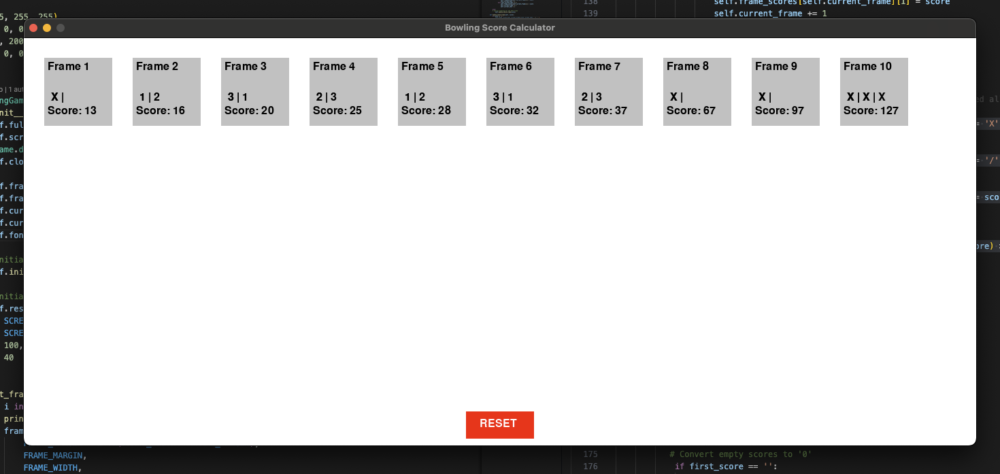

# Bowling Score Calculator

This is a simple application to calculate the score of a bowling game using Pygame.

## Installation

1. Install Pygame:
   ```sh
   pip install pygame or pip3 install pygame
   ```
2. Navigate to the project directory:
   ```
   cd path/to/project
   ```
3. Run the application:
   ```
   python bowling_score_app.py
   ```

## Usage

The application will open a window displaying the frames of a bowling game. Enter the scores for each frame and the application will calculate the total score.

### Notes:

1. Enter "X" for a strike.
2. Enter "/" for a spare.
3. Enter numbers 0-9 for regular scores.



